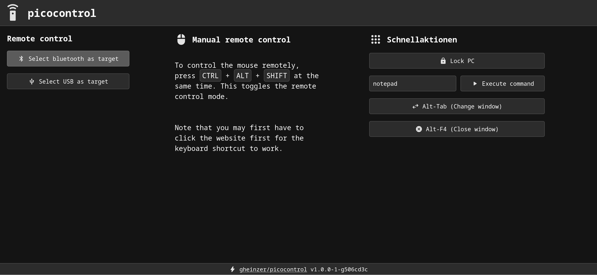

# picocontrol
Raspberry Pi Pico W-based remote control firmware for controlling a device over USB or BLE remotely via WiFi.

You can switch between controlling a BLE or USB target using the buttons on the left. By pressing `CTRL-ALT-SHIFT`, you can toggle manual remote controlling. This means your keyboard and mouse will be forwarded to the target directly.

## Installation
1. Download the `.uf2` file from the [latest release](https://github.com/gheinzer/picocontrol/releases/latest/).
2. Plug in you Raspberry Pi Pico W while pressing the BOOTSEL button. This should cause a USB drive to show up on your computer.
3. Copy the file to the USB drive and wait for the drive to disappear.
4. You can now connect to the WiFi named `picocontrol_XXXXXX` (XXXXXX is replaced by the device ID). If you enter any URL in your browser, you will be redirected to the remote control interface.
5. To use for a BLE target, you simply have to connect the target to the `picocontrol_XXXXXX` device.